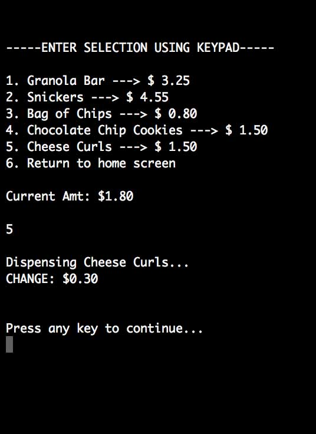

Virtual Vending Machine
 

 
Boundaries:

Inventory input file delimited by commas with ending delimiter being a newline
Price of item from file must be greater than $0, but less than $10
Quantity of each item from file must be greater than 0, but less than 75
Max number of inventory items from file: 15
Only integers entered from keypad are valid commands
Max of $10 may be inserted using 5 dollar bills - to avoid having insufficient coins to return
Max of $5 may be inserted using 1 dollar bills - to avoid having insufficient coins to return
Items will not be dispensed without appropriate funds - will get ‘Insufficient funds’ message
When inventory runs out of an item, the user will be displayed an ‘out of stock’ message
Users can press the refund button at any time. Refunds will be made with coins, not bills.
Vending machine begins with one roll of quarters ($10), one roll of dimes ($5), and one roll
	of nickels ($2). The total beginning amount of money is $17.

***When you quit the program, inventory and current denominations will be displayed on-screen.
	Also, a text file with the information will be created called ‘Report.txt’.***

***This program uses a UNIX system command called ’tput clear’ in order to clear the screen and 
	make user interaction more friendly. If this program is run with a Windows command
	prompt, then this feature will be unavailable. ***

***Inventory files to be extracted must be located in the current directory and must meet strict
	limits set by the program. Failure to meet these limits will result in an ‘Error reading file’ message.***

